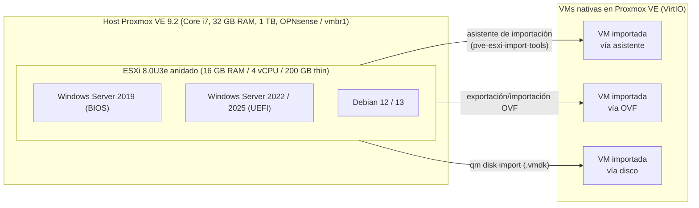

🇪🇸 Español · [🇫🇷 Français](README.md)

# Laboratorio de migración VMware → Proxmox

**Soberanía digital y salida de VMware tras la compra por Broadcom: un laboratorio real, documentado de principio a fin, por Intermovil TEC.**


## Arquitectura del laboratorio



## El problema

El fin del soporte general de vSphere 8, previsto para el **11/10/2027**, la compra de
VMware por Broadcom y los cambios de licenciamiento que siguieron están llevando a muchas
organizaciones a reevaluar su dependencia de VMware: administración francesa y
colectividades, empresas, MSP, así como sus equivalentes en Bélgica, Suiza, Quebec y
el África francófona. En este contexto, la **soberanía digital** — control de la
plataforma, del soporte y de los costos — vuelve a ser un criterio de decisión central,
y no solo un argumento técnico.

## La prueba

En lugar de hablar de ello en abstracto, este repositorio documenta un laboratorio real: un
ESXi 8 anidado dentro de Proxmox VE, con VMs de prueba (Windows Server 2019/2022/2025,
Debian 12/13) migradas después a Proxmox por las tres vías disponibles: asistente de
importación, exportación/importación OVF e importación de disco. Cada paso, cada script
y cada límite encontrado están documentados en [`docs/es/`](docs/es/), en particular:

- [`docs/es/00-architecture.md`](docs/es/00-architecture.md) — esquema detallado del laboratorio
- [`docs/es/02-esxi-imbrique.md`](docs/es/02-esxi-imbrique.md) — puesta en marcha del ESXi anidado
- [`docs/es/04-migration-assistant.md`](docs/es/04-migration-assistant.md), [`05-migration-ovf.md`](docs/es/05-migration-ovf.md), [`06-migration-disk-import.md`](docs/es/06-migration-disk-import.md) — los tres métodos de migración
- [`docs/es/07-windows-post-migration.md`](docs/es/07-windows-post-migration.md) y [`08-linux-post-migration.md`](docs/es/08-linux-post-migration.md) — puesta a punto post-migración
- [`docs/es/09-validation-rollback.md`](docs/es/09-validation-rollback.md) — validación y plan de retroceso
- [`docs/es/10-depannage.md`](docs/es/10-depannage.md) — resolución de problemas

## El método

Más allá del laboratorio técnico, una migración real sigue una metodología de proyecto:
auditoría del parque de origen (por ejemplo con RVTools), migración piloto en un alcance
reducido, y luego migración por olas sucesivas, cada una con su ventana de corte
programada y su plan de mantenimiento en condición operativa (MCO) tras el cambio. El
detalle está en [`docs/es/11-methodologie-projet.md`](docs/es/11-methodologie-projet.md).

## La oferta

Intermovil TEC acompaña a las organizaciones en su salida de VMware: diagnóstico, prueba
de concepto, migración por olas y soporte post-migración. El detalle de la oferta está
en [`SERVICIOS.md`](SERVICIOS.md).

## Contexto / soberanía digital

Este proyecto se inscribe en un movimiento más amplio en Francia y Europa: durante
**CoTer Numérique 2026** (Reims, 23-24/06/2026), varias colectividades mencionaron su
migración hacia Proxmox ante la proximidad del fin de soporte de vSphere 8. Proxmox VE
es desarrollado por **Proxmox Server Solutions GmbH**, empresa con sede en Viena
(Austria, UE), y distribuido bajo licencia libre **AGPLv3** — dos elementos que pesan en
una reflexión de soberanía digital. Detalles en
[`docs/es/12-souverainete-contexte.md`](docs/es/12-souverainete-contexte.md).

## Estructura del repositorio

```
scripts/
  proxmox/    # preparación del host, ESXi anidado, importación de VMs
  esxi/       # kickstart y post-instalación de ESXi
  windows/    # scripts PowerShell pre/post-migración
  linux/      # preparación VirtIO en Linux
docs/
  fr/         # documentación en francés (00 a 12)
  es/         # documentación en español (00 a 12)
templates/
  fr/ es/     # checklists, informe de migración, plan de olas
inventory/
  vms.example.csv
results/
  # plantillas de resultados "por medir", sin métricas inventadas
```

## Advertencia

Este repositorio documenta un **laboratorio personal** y un ejercicio de documentación
pública — no es una guía llave en mano para producción. Adapte cada script y cada
procedimiento a su entorno, sus requisitos de seguridad y sus procesos internos antes de
cualquier uso en producción.

## Licencia

Código bajo licencia **MIT** ([`LICENSE`](LICENSE)) · Documentación bajo licencia
**CC BY 4.0** ([`LICENSE-DOCS.md`](LICENSE-DOCS.md)).

## Contacto

[correo profesional]
