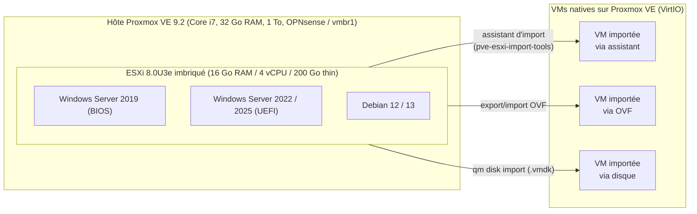

🇫🇷 Français · [🇪🇸 Español](README.es.md)

# Laboratoire de migration VMware → Proxmox

**Souveraineté numérique et sortie de VMware après le rachat par Broadcom : un laboratoire réel, documenté de bout en bout, par Intermovil TEC.**


## Architecture du laboratoire



## Le problème

La fin du support général de vSphere 8, prévue le **11/10/2027**, le rachat de VMware par
Broadcom et les changements de licensing qui ont suivi poussent de nombreuses organisations
à réévaluer leur dépendance à VMware : administration française et collectivités, entreprises,
MSP, ainsi que leurs homologues en Belgique, en Suisse, au Québec et en Afrique francophone.
Dans ce contexte, la **souveraineté numérique** — maîtrise de la plateforme, du support et
des coûts — redevient un critère de décision central, et pas seulement un argument technique.

## La preuve

Plutôt que d'en parler dans l'abstrait, ce dépôt documente un laboratoire réel : un ESXi 8
imbriqué dans Proxmox VE, avec des VMs de test (Windows Server 2019/2022/2025, Debian
12/13) migrées ensuite vers Proxmox par les trois voies disponibles — assistant d'import,
export/import OVF et import de disque. Chaque étape, chaque script et chaque limite
rencontrée sont documentés dans [`docs/fr/`](docs/fr/), notamment :

- [`docs/fr/00-architecture.md`](docs/fr/00-architecture.md) — schéma détaillé du lab
- [`docs/fr/02-esxi-imbrique.md`](docs/fr/02-esxi-imbrique.md) — mise en place de l'ESXi imbriqué
- [`docs/fr/04-migration-assistant.md`](docs/fr/04-migration-assistant.md), [`05-migration-ovf.md`](docs/fr/05-migration-ovf.md), [`06-migration-disk-import.md`](docs/fr/06-migration-disk-import.md) — les trois méthodes de migration
- [`docs/fr/07-windows-post-migration.md`](docs/fr/07-windows-post-migration.md) et [`08-linux-post-migration.md`](docs/fr/08-linux-post-migration.md) — remise en état post-migration
- [`docs/fr/09-validation-rollback.md`](docs/fr/09-validation-rollback.md) — validation et plan de retour arrière
- [`docs/fr/10-depannage.md`](docs/fr/10-depannage.md) — dépannage

## La méthode

Au-delà du laboratoire technique, une migration réelle suit une méthodologie de projet :
audit du parc source (par exemple via RVTools), migration pilote sur un périmètre réduit,
puis migration par vagues successives, chacune avec sa fenêtre de coupure planifiée et son
plan de maintien en condition opérationnelle (MCO) après bascule. Le détail est dans
[`docs/fr/11-methodologie-projet.md`](docs/fr/11-methodologie-projet.md).

## L'offre

Intermovil TEC accompagne les organisations dans leur sortie de VMware : diagnostic,
preuve de concept, migration par vagues et support post-migration. Le détail de l'offre
est dans [`OFFRE.md`](OFFRE.md).

## Contexte / souveraineté numérique

Ce projet s'inscrit dans un mouvement plus large en France et en Europe : lors de
**CoTer Numérique 2026** (Reims, 23-24/06/2026), plusieurs collectivités ont évoqué leur
migration vers Proxmox à l'approche de la fin de support de vSphere 8. Proxmox VE est
développé par **Proxmox Server Solutions GmbH**, société basée à Vienne (Autriche, UE),
et distribué sous licence libre **AGPLv3** — deux éléments qui pèsent dans une réflexion
de souveraineté numérique. Détails dans
[`docs/fr/12-souverainete-contexte.md`](docs/fr/12-souverainete-contexte.md).

## Structure du dépôt

```
scripts/
  proxmox/    # préparation de l'hôte, ESXi imbriqué, import de VMs
  esxi/       # kickstart et post-installation ESXi
  windows/    # scripts PowerShell pré/post-migration
  linux/      # préparation VirtIO côté Linux
docs/
  fr/         # documentation en français (00 à 12)
  es/         # documentation en espagnol (00 à 12)
templates/
  fr/ es/     # checklists, rapport de migration, plan de vagues
inventory/
  vms.example.csv
results/
  # gabarits de résultats « à mesurer », pas de métriques inventées
```

## Avertissement

Ce dépôt documente un **laboratoire personnel** et une démarche de documentation
publique — ce n'est pas un guide clé en main pour la production. Adaptez chaque script
et chaque procédure à votre environnement, vos contraintes de sécurité et vos processus
internes avant toute utilisation en production.

## Licence

Code sous licence **MIT** ([`LICENSE`](LICENSE)) · Documentation sous licence
**CC BY 4.0** ([`LICENSE-DOCS.md`](LICENSE-DOCS.md)).

## Contact

[email professionnel]
