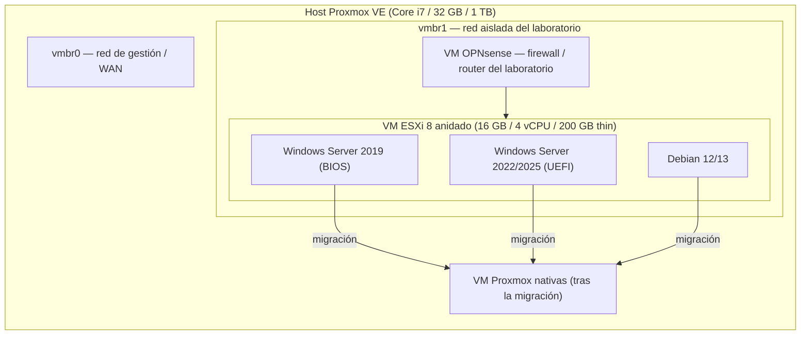

# 00 — Arquitectura del laboratorio

## Visión general

El laboratorio funciona en una sola máquina Proxmox VE. Un cortafuegos
OPNsense aísla la red del laboratorio (`vmbr1`) de la red de gestión
(`vmbr0`), de modo que las VM de prueba y el ESXi anidado nunca queden
expuestos directamente a la red que aloja al propio Proxmox. Dentro de esa
burbuja aislada corre una VM ESXi 8 anidada, que a su vez aloja las VM de
prueba que después se migrarán a Proxmox nativo.

## Hardware del autor

- Host Proxmox VE: Core i7, 32 GB RAM, 1 TB de disco, sin GPU dedicada.
- Presupuesto para el ESXi anidado: 16 GB RAM / 4 vCPU / disco único de
  200 GB thin-provisioned (sistema ESXi + datastore1 en el mismo disco).
- Dentro de ese ESXi anidado: Windows Server 2019 (BIOS), Windows Server
  2022 o 2025 (UEFI), Debian 12/13 — ver [03-vms-de-test.md](03-vms-de-test.md).

## Diagrama

El cortafuegos OPNsense actúa como puerta de enlace de la red aislada: las
VM de prueba dentro del ESXi anidado solo tienen salida a través de él. Esto
permite reproducir un entorno de cliente realista (red aislada, reglas de
filtrado) sin arriesgar la red de gestión del host.

## Tres rutas de migración

La carpeta `scripts/proxmox/` automatiza tres métodos de importación desde
el ESXi anidado hacia Proxmox nativo, documentados por separado:

1. [04-migration-assistant.md](04-migration-assistant.md) — asistente de
   importación ESXi de Proxmox (`pvesm add esxi` + `qm import`), el método
   recomendado cuando la API de ESXi es alcanzable.
2. [05-migration-ovf.md](05-migration-ovf.md) — exportación OVF con
   `ovftool` seguida de `qm importovf`, útil cuando la API de ESXi no es
   alcanzable o para archivar la VM.
3. [06-migration-disk-import.md](06-migration-disk-import.md) — importación
   directa de un `.vmdk` con `qm disk import`, para un datastore NFS
   compartido, una copia por `scp`, o una copia de seguridad restaurada.

## Siguiente

- [01-preparation-hote.md](01-preparation-hote.md) — preparar el host Proxmox.
- [02-esxi-imbrique.md](02-esxi-imbrique.md) — construir el ESXi anidado.
