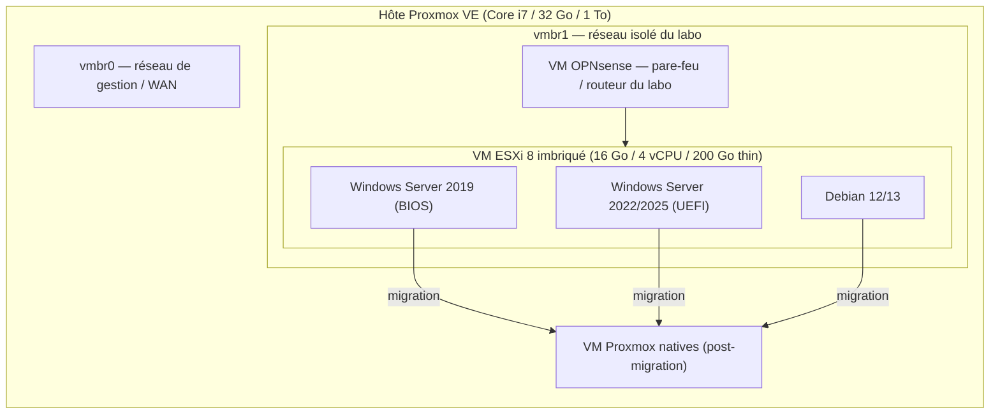

# 00 — Architecture du laboratoire

## Vue d'ensemble

Le laboratoire tient sur une seule machine Proxmox VE. Un pare-feu OPNsense
isole le réseau du labo (`vmbr1`) du réseau de gestion (`vmbr0`), de sorte que
les VM de test et l'ESXi imbriqué ne soient jamais exposés directement au
réseau qui héberge Proxmox lui-même. À l'intérieur de cette bulle isolée
tourne une VM ESXi 8 imbriquée, qui héberge à son tour les VM de test qui
seront ensuite migrées vers Proxmox natif.

## Matériel de l'auteur

- Hôte Proxmox VE : Core i7, 32 Go RAM, 1 To de disque, sans GPU dédié.
- Budget pour l'ESXi imbriqué : 16 Go RAM / 4 vCPU / disque unique de 200 Go
  thin-provisionné (système ESXi + datastore1 sur le même disque).
- Dans cet ESXi imbriqué : Windows Server 2019 (BIOS), Windows Server 2022
  ou 2025 (UEFI), Debian 12/13 — voir [03-vms-de-test.md](03-vms-de-test.md).

## Schéma

Le pare-feu OPNsense agit comme passerelle du réseau isolé : les VM de test à
l'intérieur de l'ESXi imbriqué n'ont de route de sortie qu'au travers de lui.
Cela permet de reproduire un environnement client réaliste (réseau isolé,
règles de pare-filtrage) sans risquer le réseau de gestion de l'hôte.

## Trois chemins de migration

Le dossier `scripts/proxmox/` automatise trois méthodes d'import depuis
l'ESXi imbriqué vers Proxmox natif, documentées séparément :

1. [04-migration-assistant.md](04-migration-assistant.md) — assistant
   d'import ESXi de Proxmox (`pvesm add esxi` + `qm import`), la méthode
   recommandée quand l'API ESXi est joignable.
2. [05-migration-ovf.md](05-migration-ovf.md) — export OVF avec `ovftool`
   puis `qm importovf`, utile quand l'API ESXi n'est pas joignable ou pour
   archiver la VM.
3. [06-migration-disk-import.md](06-migration-disk-import.md) — import direct
   d'un `.vmdk` avec `qm disk import`, pour un datastore NFS partagé, une
   copie par `scp`, ou une sauvegarde restaurée.

## Suite

- [01-preparation-hote.md](01-preparation-hote.md) — préparer l'hôte Proxmox.
- [02-esxi-imbrique.md](02-esxi-imbrique.md) — construire l'ESXi imbriqué.
